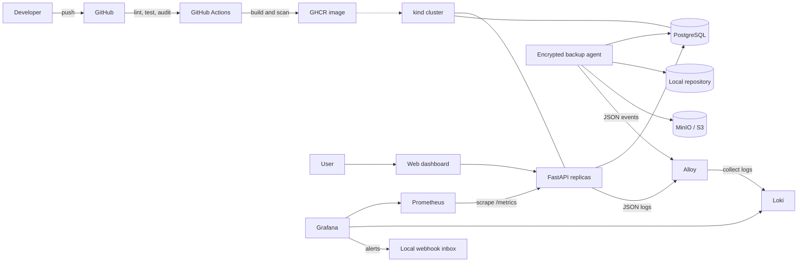

# Automated Deployment Platform

A portfolio-sized DevOps project: a FastAPI task manager backed by PostgreSQL,
packaged with Docker, tested and scanned in GitHub Actions, deployable to local
Kubernetes, and observable with Prometheus, Loki, Alloy, and Grafana. A responsive
web dashboard provides a polished interface for managing tasks and demonstrating the
platform.

## Architecture



## What this demonstrates

- REST API, database persistence, health checks, and Prometheus metrics
- Versioned Alembic database migrations with safe multi-replica startup
- Responsive task dashboard served from the same production image
- Reproducible local environment with Docker Compose
- CI quality gates, dependency audit, container scan, and GHCR publishing
- Kubernetes rolling deployments, probes, resource limits, Secrets, ConfigMaps,
  persistent storage, and rollback
- Centralized logs, request correlation, Grafana dashboards, alerts, and local delivery
- Encrypted PostgreSQL backups, retention, restore verification, and local/S3 storage

## v1.0 guides

- [Architecture and demo walkthrough](docs/v1-demo-walkthrough.md): a concise,
  ten-minute product-to-recovery presentation.
- [Production readiness](docs/production-readiness.md): capacity targets, TLS and
  secret controls, cloud deployment choices, disaster-recovery validation, and the
  release checklist.

v1.0 is portfolio/demo ready. The production-readiness guide deliberately separates
implemented controls from the additional evidence and safeguards required for an
internet-facing service.

## Quick start with Docker Compose

Requirements: Docker Desktop with Linux containers.

```powershell
Copy-Item .env.example .env
# Replace every "replace-with-..." value in .env before continuing.
docker compose up --build -d
docker compose ps
```

Open:

- Task dashboard: http://localhost:8000
- API documentation: http://localhost:8000/docs
- Prometheus: http://localhost:9090
- Human-friendly API metrics: http://localhost:8000/metrics-view
- Grafana: http://localhost:3000 (use the password configured in `.env`)
- Alert inbox: http://localhost:8081/s/11111111-2222-3333-4444-555555555555

The dashboard asks for `APP_API_KEY` when it opens. The key is retained only in that
browser tab. Compose binds every published port to `127.0.0.1`, so the services are
not exposed to other devices on your network.

Try the API:

```powershell
$headers = @{ "X-API-Key" = (Get-Content .env |
  Where-Object { $_ -like "APP_API_KEY=*" } |
  ForEach-Object { $_.Substring("APP_API_KEY=".Length) }) }
Invoke-RestMethod -Method Post -Uri http://localhost:8000/tasks -Headers $headers `
  -ContentType application/json -Body '{"title":"Learn Docker"}'
Invoke-RestMethod http://localhost:8000/tasks -Headers $headers
Invoke-RestMethod http://localhost:8000/health/ready
```

Generate traffic so the dashboard becomes interesting:

```powershell
1..100 | ForEach-Object { Invoke-RestMethod http://localhost:8000/tasks -Headers $headers }
```

Stop the environment with `docker compose down`. Add `-v` only when you intentionally
want to delete database and Grafana volumes.

## Development container

The repository includes a development container for VS Code Dev Containers and
GitHub Codespaces. It provides Python 3.13, all development dependencies, Docker,
`kubectl`, Helm, Minikube, and `kind`. A PostgreSQL development database starts
alongside it automatically.

1. Install Docker Desktop, VS Code, and the **Dev Containers** extension.
2. Open this repository in VS Code.
3. Run **Dev Containers: Reopen in Container** from the command palette.
4. Wait for the image build and automatic test/lint checks to finish.

Inside the container, start the API:

```bash
alembic upgrade head
uvicorn app.main:app --host 0.0.0.0 --port 8000 --reload
```

The database connection is already configured through `DATABASE_URL`. Port 8000 is
forwarded automatically, so open the task dashboard from the VS Code Ports panel.
Use `devcontainer-only-api-key-32-characters` to unlock this local development
workspace.
The container also runs its own Docker daemon, allowing `docker compose` and the
`scripts/deploy-kind.ps1` workflow's equivalent commands to run without depending on
the host Docker socket:

```bash
docker build -t task-manager:local .
kind create cluster --name task-manager --config kind-config.yaml
kind load docker-image task-manager:local --name task-manager
kubectl apply -k k8s
```

Rebuild the development container after changing `requirements.txt`,
`requirements-dev.txt`, or files under `.devcontainer`.

## Local development and tests

Python 3.11+ is supported. Tests use SQLite, so PostgreSQL is not required.

```powershell
python -m venv .venv
.\.venv\Scripts\Activate.ps1
python -m pip install -r requirements-dev.txt
$env:APP_API_KEY = "generate-a-private-key-at-least-32-characters"
$env:DATABASE_URL = "sqlite:///./tasks.db"
alembic upgrade head
ruff check .
ruff format --check .
pytest
uvicorn app.main:app --reload
```

Schema changes are managed with Alembic; the application never creates tables at
runtime. After changing SQLAlchemy models, generate and review a revision, then
apply it:

```powershell
alembic revision --autogenerate -m "describe the schema change"
alembic upgrade head
```

Docker Compose runs a one-shot `migrate` service before the API starts. Kubernetes
API pods run the same upgrade in an init container. PostgreSQL migrations take an
advisory lock, so rolling deployments and multiple replicas serialize upgrades.

## Local Kubernetes with kind

Install `kind`, and make sure Docker Desktop is running:

```powershell
Copy-Item k8s/app-secrets.env.example k8s/app-secrets.env
Copy-Item k8s/monitoring-secrets.env.example k8s/monitoring-secrets.env
Copy-Item k8s/backup-secrets.env.example k8s/backup-secrets.env
# Replace every placeholder in all ignored files with a strong random value.
.\scripts\deploy-kind.ps1
kubectl get all -n task-manager
kubectl port-forward service/task-api 8000:8000 -n task-manager
```

In a second terminal:

```powershell
kubectl port-forward service/prometheus 9090:9090 -n task-manager
kubectl port-forward service/grafana 3000:3000 -n task-manager
kubectl port-forward service/webhook-inbox 8081:8080 -n task-manager
```

The manifests use the locally built `task-manager:local` image. For a remote cluster,
replace it with the GHCR image produced by CI and configure an image pull secret if
the package is private.

## Centralized logging and alerts

The API writes structured JSON request events to standard output. Each response
includes `X-Request-ID`; provide your own safe ID or use the generated value to find
the same request in Grafana. Logs include the normalized route, method, status, and
duration, but never task text, request bodies, query strings, API keys, credentials,
or client IP addresses.

Grafana Alloy collects every project container or Kubernetes workload log and sends
it to single-node Loki. Loki retains seven days of local data. Open Grafana and select
the **Task Manager Operations Logs** dashboard to explore service volume, errors,
backup history, live logs, and request IDs.

Generate safe correlated traffic:

```powershell
.\scripts\generate-demo-traffic.ps1

# Include authenticated task-list and intentional 404 requests:
$env:APP_API_KEY = "the-value-from-your-env-file"
.\scripts\generate-demo-traffic.ps1 -Requests 50
```

Demonstrate alert delivery with Compose:

```powershell
.\scripts\alert-demo.ps1 -Environment compose -Action trigger
# Wait a little over two minutes for the alert evaluation.
.\scripts\alert-demo.ps1 -Environment compose -Action check
.\scripts\alert-demo.ps1 -Environment compose -Action recover
```

The check command confirms delivery from the webhook inbox logs. Open
http://127.0.0.1:8081/s/11111111-2222-3333-4444-555555555555 to inspect the firing
and resolved payloads. Use `-Environment kubernetes` for kind and port-forward the
`webhook-inbox` service first to view its UI.

Provisioned alerts cover API availability, 5xx ratio, p95 latency, rate-limit spikes,
backup or restore failures, and a missing successful backup over 26 hours. The last
alert is expected to fire on a fresh environment until its first backup succeeds.
The local inbox stores at most 128 requests in memory and is not an external paging
system.

Metrics answer “how much and how often”; logs explain which service and request
produced the event. The Compose collector reaches Docker only through a private
read-only socket proxy with state-changing requests disabled. Kubernetes Alloy uses
namespace-scoped RBAC and the Kubernetes log API without privileged access or host
filesystem mounts.

## Encrypted backups and recovery

The backup agent creates a PostgreSQL custom-format dump, records a task-count
manifest, and stores both inside a client-side encrypted Restic repository. A backup
is accepted only after `pg_dump` succeeds, the dump is non-empty, retention runs, and
`restic check --read-data` validates repository metadata and reads every encrypted
data pack.

The default policy keeps 7 daily, 4 weekly, and 3 monthly snapshots. The operational
targets are a 24-hour recovery point objective (RPO) and a restore time objective
(RTO) under 15 minutes for this project-sized database.

Configure `RESTIC_PASSWORD` in `.env` before using either Compose backend. Losing this
password makes the encrypted backups unrecoverable.

### Compose: local encrypted repository

The local backend writes encrypted Restic data to the ignored `backups/` directory:
Compose first runs a restricted one-shot initializer so the directory is writable by
the non-root backup agent on both Windows and Linux.

```powershell
.\scripts\backup.ps1 -Environment compose -Backend local
.\scripts\restore-backup.ps1 -Environment compose -Backend local -Snapshot latest
```

The restore command recreates `tasks_restore_test`, restores the snapshot, confirms
the `tasks` table exists, and compares its row count with the backup manifest. It does
not modify the active `tasks` database.

List encrypted snapshots:

```powershell
docker compose --profile backup-local run --rm -e MODE=snapshots backup-local
```

### Compose: S3-compatible MinIO repository

Set `MINIO_ROOT_USER` and `MINIO_ROOT_PASSWORD` in `.env`, then run:

```powershell
.\scripts\backup.ps1 -Environment compose -Backend s3
.\scripts\restore-backup.ps1 -Environment compose -Backend s3 -Snapshot latest
```

The profile starts a private MinIO server, initializes the
`task-manager-backups` bucket, and stores Restic's encrypted repository in it. The
MinIO console is available only on http://127.0.0.1:9001.

### Kubernetes scheduled backups

The local backend is deployed by default:

```powershell
.\scripts\deploy-kind.ps1 -BackupBackend local
kubectl get cronjob postgres-backup -n task-manager
.\scripts\backup.ps1 -Environment kubernetes -Backend local
.\scripts\restore-backup.ps1 -Environment kubernetes -Backend local
```

`postgres-backup` runs every day at `02:00 Europe/Paris` and writes to the dedicated
`postgres-backups` PVC. `postgres-restore-verification` is suspended and serves only
as a safe Job template.

Deploy the optional in-cluster S3 demonstration instead:

```powershell
.\scripts\deploy-kind.ps1 -BackupBackend s3
.\scripts\backup.ps1 -Environment kubernetes -Backend s3
.\scripts\restore-backup.ps1 -Environment kubernetes -Backend s3
```

For managed S3, replace the overlay repository URL and map its access credentials
through `backup-secrets`; the dump and Restic workflow remain unchanged.

### Live recovery

Live replacement is deliberately gated. The command stops the API, requires typing
`RESTORE tasks`, restores the selected snapshot, verifies it, and restarts the API:

```powershell
.\scripts\restore-backup.ps1 -Environment compose -Backend local `
  -Snapshot latest -ReplaceActiveDatabase
```

Use the equivalent Kubernetes parameters for cluster recovery. Always perform a
verification restore first. A PVC alone is not a disaster-recovery copy; use the S3
backend outside the cluster for real infrastructure-loss protection.

### Recovery failure demonstrations

- Set an incorrect `RESTIC_PASSWORD`; snapshot listing and restore must fail.
- Stop PostgreSQL; backup creation must fail without creating an accepted snapshot.
- Stop MinIO; the S3 backup must fail and retain the prior snapshots.
- Restore an older snapshot ID into `tasks_restore_test` and compare its task count.

## Rolling update and rollback demonstration

View a normal deployment:

```powershell
kubectl rollout status deployment/task-api -n task-manager
kubectl rollout history deployment/task-api -n task-manager
```

Run the failure demonstration:

```powershell
.\scripts\rollback-demo.ps1
kubectl get pods -n task-manager
kubectl rollout history deployment/task-api -n task-manager
```

The script requests a nonexistent image. Kubernetes keeps the previous ready replicas
available because `maxUnavailable` is zero, the rollout times out, and the script
uses `kubectl rollout undo` to restore the last revision.

## CI/CD pipeline

Pull requests run linting, formatting checks, tests with coverage, `pip-audit`,
shell and PowerShell validation, Alloy/Loki configuration checks, Kubernetes
rendering, and an end-to-end Compose logging smoke test.
A push to `main` additionally:

1. Builds the non-root API and backup-agent containers.
2. Scans both local images with Trivy and blocks fixable high/critical findings.
3. Publishes `latest` and commit-SHA tags only after both scans pass.

Repository packages are published as `ghcr.io/<owner>/<repository>`. The workflow
uses the built-in `GITHUB_TOKEN`; no personal token is required.

## Operations and troubleshooting

| Symptom | Check | Recovery |
|---|---|---|
| API is not ready | `docker compose logs api db` | Confirm `DATABASE_URL`, then restart |
| Dashboard rejects the key | Check `APP_API_KEY` in the active environment | Restart the API after changing it |
| PostgreSQL will not start | `docker compose logs db` | Check credentials and port usage |
| Kubernetes pod pending | `kubectl describe pod -n task-manager <pod>` | Check PVC and available resources |
| `ImagePullBackOff` | `kubectl describe pod -n task-manager <pod>` | Load local image into kind or fix registry access |
| Dashboard has no data | Prometheus **Status → Targets** | Confirm the API target is up and generate traffic |
| Grafana has no logs | `docker compose logs alloy loki` | Confirm Alloy and Loki are healthy, then generate traffic |
| Alert inbox is empty | Check Grafana **Alerting** and wait through the rule duration | Run the alert check again after the rule fires |
| Bad Kubernetes release | `kubectl rollout history deployment/task-api -n task-manager` | Run `kubectl rollout undo deployment/task-api -n task-manager` |

Health endpoints have separate purposes:

- `/health/live`: confirms that the process is running.
- `/health/ready`: checks database connectivity before accepting traffic.

The browser-facing routes are:

- `/`: responsive task dashboard.
- `/api/info`: protected service metadata.
- `/docs`: interactive OpenAPI documentation.
- `/metrics-view`: styled, auto-refreshing operational metrics.
- `/metrics`: raw Prometheus exposition consumed by Prometheus.

## Security notes

- Task data requires an `X-API-Key`; `/docs` exposes an **Authorize** button for it.
- Secrets are supplied through ignored local files and are not committed to Git.
- Responses include CSP, clickjacking, MIME-sniffing, referrer, and permissions headers.
- Request logs use an allowlist of fields and omit task data, headers, credentials,
  query strings, request bodies, and client addresses.
- Task routes are rate limited and task-list responses are capped at 100 records.
- Compose ports listen only on localhost, and the API container is read-only/non-root.
- Kubernetes disables service account mounts, restricts container privileges, and
  applies default-deny NetworkPolicies with explicit service-to-service allowances.
- Database dumps are encrypted by Restic before local or S3 storage, and credentials
  are supplied only through ignored files and Kubernetes Secrets.
- CI uses least-privilege token permissions and scans the image before publishing it.

The API key is shared access control, not full user authentication. For an
internet-facing deployment, additionally use TLS at an ingress or reverse proxy,
store secrets in a managed secret service, pin images and Actions by digest/SHA,
replace the in-process rate limiter with a distributed gateway limiter, and implement
individual user identities with audited authorization.

## Portfolio presentation

Capture screenshots of the task dashboard, GitHub Actions run, API docs, Kubernetes
pods, Prometheus target, Grafana metrics and logs dashboards, a firing alert, its
webhook delivery, failed rollout, and successful rollback. A short demo can follow
this story: push code → watch CI → create and complete a task → inspect its metrics
and correlated request log → stop the API → receive an alert → recover the API →
show the resolved notification.

For a reliability-focused demo, add: create tasks → take an encrypted snapshot →
delete data → restore into `tasks_restore_test` → compare row counts → show the
scheduled Kubernetes CronJob and retention history.
