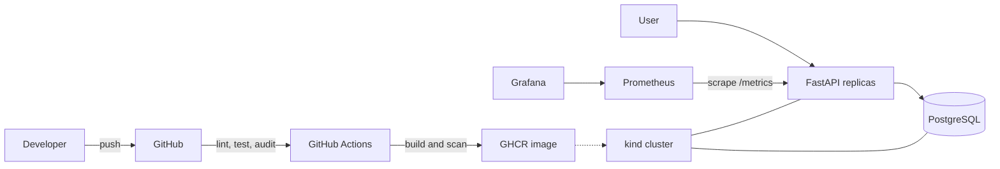

# Automated Deployment Platform

A portfolio-sized DevOps project: a FastAPI task manager backed by PostgreSQL,
packaged with Docker, tested and scanned in GitHub Actions, deployable to local
Kubernetes, and observable with Prometheus and Grafana.

## Architecture



## What this demonstrates

- REST API, database persistence, health checks, and Prometheus metrics
- Reproducible local environment with Docker Compose
- CI quality gates, dependency audit, container scan, and GHCR publishing
- Kubernetes rolling deployments, probes, resource limits, Secrets, ConfigMaps,
  persistent storage, and rollback
- Pre-provisioned Grafana dashboard for availability, traffic, latency, and errors

## Quick start with Docker Compose

Requirements: Docker Desktop with Linux containers.

```powershell
Copy-Item .env.example .env
docker compose up --build -d
docker compose ps
```

Open:

- API documentation: http://localhost:8000/docs
- Prometheus: http://localhost:9090
- Grafana: http://localhost:3000 (`admin` / `admin` by default)

Try the API:

```powershell
Invoke-RestMethod -Method Post -Uri http://localhost:8000/tasks `
  -ContentType application/json -Body '{"title":"Learn Docker"}'
Invoke-RestMethod http://localhost:8000/tasks
Invoke-RestMethod http://localhost:8000/health/ready
```

Generate traffic so the dashboard becomes interesting:

```powershell
1..100 | ForEach-Object { Invoke-RestMethod http://localhost:8000/tasks }
```

Stop the environment with `docker compose down`. Add `-v` only when you intentionally
want to delete database and Grafana volumes.

## Development container

The repository includes a development container for VS Code Dev Containers and
GitHub Codespaces. It provides Python 3.13, all development dependencies, Docker,
`kubectl`, Helm, Minikube, and `kind`. A PostgreSQL development database starts
alongside it automatically.

1. Install Docker Desktop, VS Code, and the **Dev Containers** extension.
2. Open this repository in VS Code.
3. Run **Dev Containers: Reopen in Container** from the command palette.
4. Wait for the image build and automatic test/lint checks to finish.

Inside the container, start the API:

```bash
uvicorn app.main:app --host 0.0.0.0 --port 8000 --reload
```

The database connection is already configured through `DATABASE_URL`. Port 8000 is
forwarded automatically, so open the API documentation from the VS Code Ports panel.
The container also runs its own Docker daemon, allowing `docker compose` and the
`scripts/deploy-kind.ps1` workflow's equivalent commands to run without depending on
the host Docker socket:

```bash
docker build -t task-manager:local .
kind create cluster --name task-manager --config kind-config.yaml
kind load docker-image task-manager:local --name task-manager
kubectl apply -k k8s
```

Rebuild the development container after changing `requirements.txt`,
`requirements-dev.txt`, or files under `.devcontainer`.

## Local development and tests

Python 3.11+ is supported. Tests use SQLite, so PostgreSQL is not required.

```powershell
python -m venv .venv
.\.venv\Scripts\Activate.ps1
python -m pip install -r requirements-dev.txt
ruff check .
ruff format --check .
pytest
```

## Local Kubernetes with kind

Install `kind`, and make sure Docker Desktop is running:

```powershell
.\scripts\deploy-kind.ps1
kubectl get all -n task-manager
kubectl port-forward service/task-api 8000:8000 -n task-manager
```

In a second terminal:

```powershell
kubectl port-forward service/prometheus 9090:9090 -n task-manager
kubectl port-forward service/grafana 3000:3000 -n task-manager
```

The manifests use the locally built `task-manager:local` image. For a remote cluster,
replace it with the GHCR image produced by CI and configure an image pull secret if
the package is private.

### Rolling update and rollback demonstration

View a normal deployment:

```powershell
kubectl rollout status deployment/task-api -n task-manager
kubectl rollout history deployment/task-api -n task-manager
```

Run the failure demonstration:

```powershell
.\scripts\rollback-demo.ps1
kubectl get pods -n task-manager
kubectl rollout history deployment/task-api -n task-manager
```

The script requests a nonexistent image. Kubernetes keeps the previous ready replicas
available because `maxUnavailable` is zero, the rollout times out, and the script
uses `kubectl rollout undo` to restore the last revision.

## CI/CD pipeline

Pull requests run linting, formatting checks, tests with coverage, and `pip-audit`.
A push to `main` additionally:

1. Builds the multi-stage, non-root container.
2. Publishes `latest` and commit-SHA tags to GitHub Container Registry.
3. Scans the published image with Trivy and fails on fixable high/critical findings.

Repository packages are published as `ghcr.io/<owner>/<repository>`. The workflow
uses the built-in `GITHUB_TOKEN`; no personal token is required.

## Operations and troubleshooting

| Symptom | Check | Recovery |
|---|---|---|
| API is not ready | `docker compose logs api db` | Confirm `DATABASE_URL`, then restart |
| PostgreSQL will not start | `docker compose logs db` | Check credentials and port usage |
| Kubernetes pod pending | `kubectl describe pod -n task-manager <pod>` | Check PVC and available resources |
| `ImagePullBackOff` | `kubectl describe pod -n task-manager <pod>` | Load local image into kind or fix registry access |
| Dashboard has no data | Prometheus **Status → Targets** | Confirm the API target is up and generate traffic |
| Bad Kubernetes release | `kubectl rollout history deployment/task-api -n task-manager` | Run `kubectl rollout undo deployment/task-api -n task-manager` |

Health endpoints have separate purposes:

- `/health/live`: confirms that the process is running.
- `/health/ready`: checks database connectivity before accepting traffic.

## Security notes

The checked-in Kubernetes password is deliberately a local-development example.
For a real environment, create the Secret out of band or use a secret manager, use
TLS, restrict network access, pin images by digest, and change Grafana credentials.

## Portfolio presentation

Capture screenshots of the GitHub Actions run, API docs, Kubernetes pods, Prometheus
target, Grafana dashboard, failed rollout, and successful rollback. A two-minute demo
can follow this story: push code → watch CI → create a task → inspect metrics → deploy
a broken image → show zero downtime → roll back.
