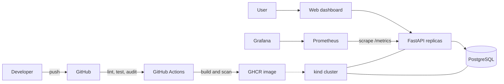

# Automated Deployment Platform

A portfolio-sized DevOps project: a FastAPI task manager backed by PostgreSQL,
packaged with Docker, tested and scanned in GitHub Actions, deployable to local
Kubernetes, and observable with Prometheus and Grafana. A responsive web dashboard
provides a polished interface for managing tasks and demonstrating the platform.

## Architecture



## What this demonstrates

- REST API, database persistence, health checks, and Prometheus metrics
- Responsive task dashboard served from the same production image
- Reproducible local environment with Docker Compose
- CI quality gates, dependency audit, container scan, and GHCR publishing
- Kubernetes rolling deployments, probes, resource limits, Secrets, ConfigMaps,
  persistent storage, and rollback
- Pre-provisioned Grafana dashboard for availability, traffic, latency, and errors

## Quick start with Docker Compose

Requirements: Docker Desktop with Linux containers.

```powershell
Copy-Item .env.example .env
# Replace every "replace-with-..." value in .env before continuing.
docker compose up --build -d
docker compose ps
```

Open:

- Task dashboard: http://localhost:8000
- API documentation: http://localhost:8000/docs
- Prometheus: http://localhost:9090
- Human-friendly API metrics: http://localhost:8000/metrics-view
- Grafana: http://localhost:3000 (use the password configured in `.env`)

The dashboard asks for `APP_API_KEY` when it opens. The key is retained only in that
browser tab. Compose binds every published port to `127.0.0.1`, so the services are
not exposed to other devices on your network.

Try the API:

```powershell
$headers = @{ "X-API-Key" = (Get-Content .env |
  Where-Object { $_ -like "APP_API_KEY=*" } |
  ForEach-Object { $_.Substring("APP_API_KEY=".Length) }) }
Invoke-RestMethod -Method Post -Uri http://localhost:8000/tasks -Headers $headers `
  -ContentType application/json -Body '{"title":"Learn Docker"}'
Invoke-RestMethod http://localhost:8000/tasks -Headers $headers
Invoke-RestMethod http://localhost:8000/health/ready
```

Generate traffic so the dashboard becomes interesting:

```powershell
1..100 | ForEach-Object { Invoke-RestMethod http://localhost:8000/tasks -Headers $headers }
```

Stop the environment with `docker compose down`. Add `-v` only when you intentionally
want to delete database and Grafana volumes.

## Development container

The repository includes a development container for VS Code Dev Containers and
GitHub Codespaces. It provides Python 3.13, all development dependencies, Docker,
`kubectl`, Helm, Minikube, and `kind`. A PostgreSQL development database starts
alongside it automatically.

1. Install Docker Desktop, VS Code, and the **Dev Containers** extension.
2. Open this repository in VS Code.
3. Run **Dev Containers: Reopen in Container** from the command palette.
4. Wait for the image build and automatic test/lint checks to finish.

Inside the container, start the API:

```bash
uvicorn app.main:app --host 0.0.0.0 --port 8000 --reload
```

The database connection is already configured through `DATABASE_URL`. Port 8000 is
forwarded automatically, so open the task dashboard from the VS Code Ports panel.
Use `devcontainer-only-api-key-32-characters` to unlock this local development
workspace.
The container also runs its own Docker daemon, allowing `docker compose` and the
`scripts/deploy-kind.ps1` workflow's equivalent commands to run without depending on
the host Docker socket:

```bash
docker build -t task-manager:local .
kind create cluster --name task-manager --config kind-config.yaml
kind load docker-image task-manager:local --name task-manager
kubectl apply -k k8s
```

Rebuild the development container after changing `requirements.txt`,
`requirements-dev.txt`, or files under `.devcontainer`.

## Local development and tests

Python 3.11+ is supported. Tests use SQLite, so PostgreSQL is not required.

```powershell
python -m venv .venv
.\.venv\Scripts\Activate.ps1
python -m pip install -r requirements-dev.txt
$env:APP_API_KEY = "generate-a-private-key-at-least-32-characters"
$env:DATABASE_URL = "sqlite:///./tasks.db"
ruff check .
ruff format --check .
pytest
uvicorn app.main:app --reload
```

## Local Kubernetes with kind

Install `kind`, and make sure Docker Desktop is running:

```powershell
Copy-Item k8s/app-secrets.env.example k8s/app-secrets.env
Copy-Item k8s/monitoring-secrets.env.example k8s/monitoring-secrets.env
# Replace every placeholder in both ignored files with a strong random value.
.\scripts\deploy-kind.ps1
kubectl get all -n task-manager
kubectl port-forward service/task-api 8000:8000 -n task-manager
```

In a second terminal:

```powershell
kubectl port-forward service/prometheus 9090:9090 -n task-manager
kubectl port-forward service/grafana 3000:3000 -n task-manager
```

The manifests use the locally built `task-manager:local` image. For a remote cluster,
replace it with the GHCR image produced by CI and configure an image pull secret if
the package is private.

### Rolling update and rollback demonstration

View a normal deployment:

```powershell
kubectl rollout status deployment/task-api -n task-manager
kubectl rollout history deployment/task-api -n task-manager
```

Run the failure demonstration:

```powershell
.\scripts\rollback-demo.ps1
kubectl get pods -n task-manager
kubectl rollout history deployment/task-api -n task-manager
```

The script requests a nonexistent image. Kubernetes keeps the previous ready replicas
available because `maxUnavailable` is zero, the rollout times out, and the script
uses `kubectl rollout undo` to restore the last revision.

## CI/CD pipeline

Pull requests run linting, formatting checks, tests with coverage, and `pip-audit`.
A push to `main` additionally:

1. Builds the multi-stage, non-root container.
2. Scans the local image with Trivy and blocks fixable high/critical findings.
3. Publishes `latest` and commit-SHA tags only after the scan passes.

Repository packages are published as `ghcr.io/<owner>/<repository>`. The workflow
uses the built-in `GITHUB_TOKEN`; no personal token is required.

## Operations and troubleshooting

| Symptom | Check | Recovery |
|---|---|---|
| API is not ready | `docker compose logs api db` | Confirm `DATABASE_URL`, then restart |
| Dashboard rejects the key | Check `APP_API_KEY` in the active environment | Restart the API after changing it |
| PostgreSQL will not start | `docker compose logs db` | Check credentials and port usage |
| Kubernetes pod pending | `kubectl describe pod -n task-manager <pod>` | Check PVC and available resources |
| `ImagePullBackOff` | `kubectl describe pod -n task-manager <pod>` | Load local image into kind or fix registry access |
| Dashboard has no data | Prometheus **Status → Targets** | Confirm the API target is up and generate traffic |
| Bad Kubernetes release | `kubectl rollout history deployment/task-api -n task-manager` | Run `kubectl rollout undo deployment/task-api -n task-manager` |

Health endpoints have separate purposes:

- `/health/live`: confirms that the process is running.
- `/health/ready`: checks database connectivity before accepting traffic.

The browser-facing routes are:

- `/`: responsive task dashboard.
- `/api/info`: protected service metadata.
- `/docs`: interactive OpenAPI documentation.
- `/metrics-view`: styled, auto-refreshing operational metrics.
- `/metrics`: raw Prometheus exposition consumed by Prometheus.

## Security notes

- Task data requires an `X-API-Key`; `/docs` exposes an **Authorize** button for it.
- Secrets are supplied through ignored local files and are not committed to Git.
- Responses include CSP, clickjacking, MIME-sniffing, referrer, and permissions headers.
- Task routes are rate limited and task-list responses are capped at 100 records.
- Compose ports listen only on localhost, and the API container is read-only/non-root.
- Kubernetes disables service account mounts, restricts container privileges, and
  applies default-deny NetworkPolicies with explicit service-to-service allowances.
- CI uses least-privilege token permissions and scans the image before publishing it.

The API key is shared access control, not full user authentication. For an
internet-facing deployment, additionally use TLS at an ingress or reverse proxy,
store secrets in a managed secret service, pin images and Actions by digest/SHA,
replace the in-process rate limiter with a distributed gateway limiter, and implement
individual user identities with audited authorization.

## Portfolio presentation

Capture screenshots of the task dashboard, GitHub Actions run, API docs, Kubernetes
pods, Prometheus target, Grafana dashboard, failed rollout, and successful rollback.
A two-minute demo can follow this story: push code → watch CI → create and complete a
task in the dashboard → inspect metrics → deploy a broken image → show zero downtime
→ roll back.
