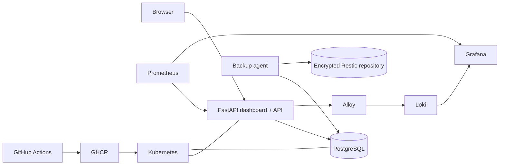

# v1.0 Architecture and Demo Walkthrough

This walkthrough presents the project in about ten minutes. It starts with the user
experience, follows one request through the platform, and finishes with failure
recovery.

## Architecture in one minute

The browser dashboard and REST API ship in one non-root FastAPI image. The API stores
tasks in PostgreSQL and exposes separate liveness, readiness, and Prometheus
endpoints. GitHub Actions validates the code and manifests, scans the images, and
publishes immutable commit-tagged images to GHCR.

In Kubernetes, probes and a rolling Deployment keep healthy replicas serving while
an update is applied. Prometheus records service metrics, Alloy forwards structured
logs to Loki, and Grafana provides dashboards and alerting. A separate backup agent
creates PostgreSQL dumps and encrypts them with Restic before writing to local or
S3-compatible storage.



## Demo preparation

Start the Compose environment and generate a little traffic:

```powershell
Copy-Item .env.example .env
# Replace every placeholder in .env.
docker compose up --build -d
$env:APP_API_KEY = "the-value-from-your-env-file"
.\scripts\generate-demo-traffic.ps1 -Requests 50
```

Open the task dashboard at <http://localhost:8000>, Grafana at
<http://localhost:3000>, and the alert inbox at
<http://localhost:8081/s/11111111-2222-3333-4444-555555555555>.

## Ten-minute demo

1. **Product (2 minutes).** Unlock the dashboard, create a task, search for it,
   mark it complete, and filter by status. Open `/docs` to show the same operations
   as an authenticated API.
2. **Delivery (1 minute).** Show the latest GitHub Actions run: lint, tests,
   dependency audit, manifest validation, image build, Trivy scan, and immutable
   GHCR tag.
3. **Runtime (2 minutes).** Show the API replicas and probes with
   `kubectl get pods -n task-manager`, then open the Grafana service dashboard.
   Point out request rate, errors, and latency.
4. **Trace a request (1 minute).** Copy an `X-Request-ID` response header and search
   for it in the operations-log dashboard. Explain that logs deliberately omit task
   text, request bodies, credentials, query strings, and client addresses.
5. **Safe deployment failure (2 minutes).** Run `.\scripts\rollback-demo.ps1`.
   Show that the unavailable image never replaces the ready replicas, followed by
   the automatic rollback.
6. **Recovery (2 minutes).** Run a backup and verification restore:

   ```powershell
   .\scripts\backup.ps1 -Environment compose -Backend local
   .\scripts\restore-backup.ps1 -Environment compose -Backend local -Snapshot latest
   ```

   The restore goes to `tasks_restore_test`, confirms the schema, and reconciles the
   task count without touching the live database.

## What v1.0 proves

- A repeatable path from commit to scanned container image
- Health-aware rolling deployment and rollback
- Metrics, structured logs, request correlation, dashboards, and alerts
- Encrypted, retained backups with a non-destructive restore check
- Local Compose and Kubernetes environments suitable for review and demonstration

The release is portfolio/demo ready. Internet-facing production use still requires
the controls and validation in [Production Readiness](production-readiness.md).
